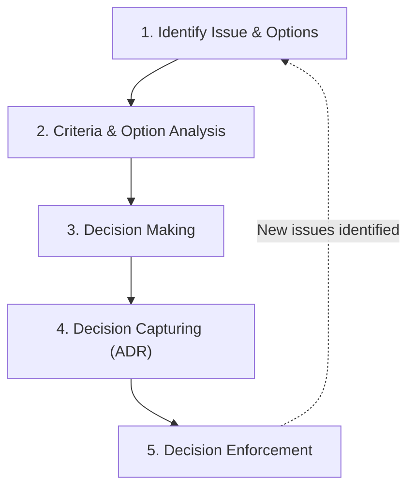

# Architectural Decision Record

> **Summary**: An Architectural Decision Record (ADR) is a brief document capturing a single architectural design choice, its rationale, context, and consequences, serving as the persistent log of a project's technical history.

## Core Concept

While software projects traditionally document features and code structure, they often omit the **why** behind core architectural choices. An **Architectural Decision Record (ADR)** solves this by persistently logging design rationale. Captured in short text files, ADRs live next to the codebase, ensuring they are version-controlled, collaborative, and omnipresent. The entire collection of ADRs forms a project's **decision log**.

## The Multi-Faceted Nature of ADRs

According to Olaf Zimmermann, a valuable ADR exhibits several key characteristics:
- **Executive Summary**: Distills technical context down to the bare essentials required to understand what was chosen and why.
- **Verdict / Scale**: Explains the trade-offs, balancing the benefits of the chosen option against its drawbacks, and documents all evaluated (but rejected) options.
- **Letter of Intent**: Employs assertive language to name decision-makers and hold them accountable for decision enforcement.
- **Action Plan**: Outlines concrete steps for execution, implementation, and follow-up reviews.
- **Contract**: Acts as a formal agreement among stakeholders that the decision meets quality and alignment expectations.

---

## The 5-Step ADMM Lifecycle

Architectural Decision Management and Modeling (ADMM) divides the lifecycle of an AD and its corresponding ADR into five logical steps:

1. **Identification**: Identify the core technical problem (question) and the design options that address it.
2. **Analysis**: Collect specific evaluation criteria (decision drivers) and analyze the pros/cons of each option.
3. **Decision Making**: Select the preferred option, finalize the rationale, and align stakeholders. (Requires satisfying the [[AD Definition of Ready]]).
4. **Decision Capturing**: Document the context, decision, and consequences using a standardized ADR template. (Requires satisfying the [[AD Definition of Done]]).
5. **Enforcement**: Implement the decision and periodically monitor/review whether it successfully resolves the problem.

---

## Key Points

- ADRs focus on the *why* of architecture, preventing design decisions from fading as team members change.
- Standardizing the template reduces documentation overhead and supports automated tooling.
- Team members should build the habit of asking at the end of meetings: *"Did we just make a decision worth documenting?"*
- Decisions can be split into stages (short-term, mid-term, long-term) if a single final answer is not yet clear.

## Related Concepts

- [[Architectural Decision]]
- [[MADR]]
- [[AD Definition of Ready]]
- [[AD Definition of Done]]
- [[ADR Adoption and Practices]]

## Source References

- [Architectural Decision Records (ADRs)](../Raw/Sources/Architectural%20Decision%20Records%20(ADRs).md)
- [Documenting Architecture Decisions](../Raw/Sources/Documenting%20Architecture%20Decisions.md)
- [How to create Architectural Decision Records (ADRs) — and how not to](../Raw/Sources/How%20to%20create%20Architectural%20Decision%20Records%20(ADRs)%20—%20and%20how%20not%20to.md)
- [A Definition of Ready for Architectural Decisions (ADs)](../Raw/Sources/A%20Definition%20of%20Ready%20for%20Architectural%20Decisions%20(ADs).md)

## Changelog

| Date | Change |
|---|---|
| 2026-07-19 | Initial creation |

---

*This note was generated from the `_templates/wiki-note.md` template.*
*Run `python scripts/wiki_tool.py lint` before committing.*
